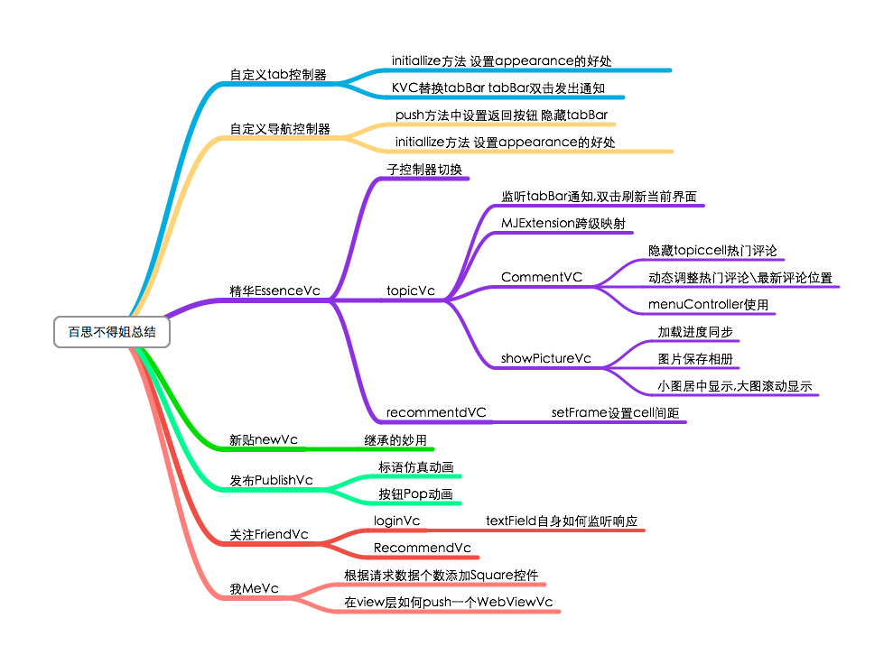
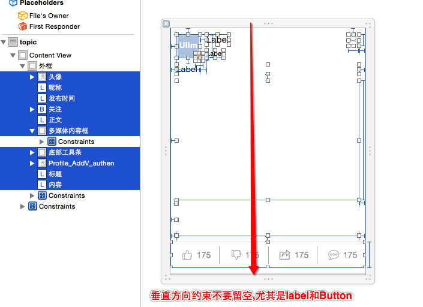
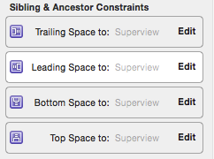
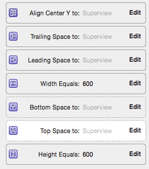

# Autolayout 实现百思不得姐总结

##精华模块切换子控制器,使用系统的切换方法实现
* 把全部\视频\声音\图片\段子五个topic控制器添加为EssenceVc的子控制器,通过以下方法切换
```objc
- (void)transitionFromViewController:(UIViewController *)fromViewController toViewController:(UIViewController *)toViewController duration:(NSTimeInterval)duration options:(UIViewAnimationOptions)options animations:(void (^)(void))animations completion:(void (^)(BOOL finished))completion NS_AVAILABLE_IOS(5_0);
```

##精华模块整个Cell都使用AutoLayout约束高度,免去模型中cellheight计算
* 现在cellxib中将垂直方向的约束都设置好



* 非等高cell高度不需要挨个计算cell中每一个控件高度累加,仅需此一行代码,跟新图片高度约束既可
```objc
    self.multiMediaViewHeight.constant = topic.pictureSize.height; // 更新约束
```
* 在topic控制器中设置TableView的cell自动布局属性

```objc
    self.tableView.estimatedRowHeight = 250;
    self.tableView.rowHeight = UITableViewAutomaticDimension;
```
##精华模块cell简单自定义控件分类方法,写在同一个文件,免去创建多个.h和.m文件
* 在这里我把cell中用到得背景View,通过自定义,重写- (void)drawRect:
* 给cell底部按钮自定义Button封装一个设置内部标题的方法
* 由于两个自定义控件功能都极其简单,所以没必要创建两对.h .m文件,直接写在cell.h文件中(代码如下),如果为了不让外界知道,也可放在.m文件,但必须主要自定义控件interface要在最前面
```objc
@interface HYWContentButton : UIButton // 顶\踩\分享\评论按钮
- (void)setTitleCount:(NSInteger)count placeholder:(NSString *)placeholder;
@end

@interface HYWTopicCellBgView : UIView // 立体感背景
@end
```
##精华模块图片点击放大查看,使用Autolayout调整小图居中和大图全屏显示
* scrollview约束没啥可以说的,上下左右全对齐

* 关键在于子控件ImageView的设置
* 首先要设置iamgeview的Mode为aspectFit,约束设置如下

* 为何Imageview约束要设置这么多,请听我一一道来
* 首先imageview的布局是由top(或者centerY) leading width height决定,这里巧妙的使用优先级,top和centerY想让哪个起作用就让哪个起作用.也正因为这样,才能达到,小图我就让他居中显示,大图我就让它顶部对齐.有人看到width和height设置为600,以为我是不是傻啊,别着急.
* 同时父控件的contentsize由trailing bottom,以及上面的width和height共同决定.
* 而在代码中优先级是这样设置的

```objc
	// 曾经一度我认为这种动态变化内容,要想设置宽高约束只能通过Masonry代码实现
	// 突然有一天我发现,为何不可以先在xib随便设置宽高,然后在外面修改约束的constant不就可以了吗
    self.imageviewWidthConstraint.constant = HYWScreenW;
    self.imageviewHeightConstraint.constant = pictureH;
    
    // 这句代码非常关键,也非常巧妙,
	// 图片超过屏幕高度centerY调为低,这时ImageView优先级为top(中) bottom(低) centerY(低) 因此顶部对齐
	// 图片不超过屏幕高度centerY调为高,这是ImageView优先级为centerY(高) top(中) bottom(低) 因此居中显示
    self.imageViewCenterConstraint.priority = pictureH > HYWScreenH ? UILayoutPriorityDefaultLow : UILayoutPriorityRequired;
    // 这里可能又有人怀疑鄙人的智商了,既然bottom始终为低,为何干脆不去掉呢?NO.别忘了scrollView要滚动,必须要bottom有约束才能让scrollview知道自己滚到哪里
    // 那又有人问了,为何要设置优先级为低了.因为设置为高或者中,图片一出来看到的就是最小面了.理不清的仔细想想.
```

##发布模块,标语使用仿真动画,按钮添加透明度和缩放动画
* 在原本的动画基础上添加了透明度和缩放的动画

```objc
        [self setupButtonLayerAnimation:button.layer
                  propertyAnimationName:kPOPLayerOpacity
                              fromValue:@(0)
                                toValue:@(1.0)
                       springBounciness:0.1
                            springSpeed:1
                             begingTime:CACurrentMediaTime() + HYWSpringFactor *i];
        
        [self setupButtonLayerAnimation:button.layer
                  propertyAnimationName:kPOPLayerScaleXY
                              fromValue:[NSValue valueWithCGSize:CGSizeMake(0.5f, 0.5f)]
                                toValue:[NSValue valueWithCGSize:CGSizeMake(1.f, 1.f)]
                       springBounciness:18
                            springSpeed:1
                             begingTime:CACurrentMediaTime() + HYWSpringFactor *i];

        [self setupButtonLayerAnimation:button.layer
                  propertyAnimationName:kPOPLayerPositionY
                              fromValue:@(0)
                                toValue:@(button.layer.position.y)
                       springBounciness:12
                            springSpeed:1
                             begingTime:CACurrentMediaTime() + HYWSpringFactor * i];
```
##贴子模块上拉和下拉请求,封装到同一个方法
* 上拉和下拉相同的请求参数
```objc
- (void)loadData:(MJRefreshComponent *)refresh {
    
    // 参数
    NSMutableDictionary *params = [NSMutableDictionary dictionary];
    params[@"a"] = self.a;
    params[@"c"] = @"data";
    params[@"type"] = @(self.type);
```
* MJRefresh刷新时会将控件本身传入,根据控件类型,判断上拉还是下拉,设置不同的参数
```objc

    if ([refresh isKindOfClass:[MJRefreshAutoNormalFooter class]]) {
        if (self.maxtime) {
            params[@"maxtime"] = self.maxtime;
        }
        params[@"page"] = @(self.page++);
    }else {
        self.page = 0;
        params[@"page"] = @(self.page);
    }
    self.parmas = params;
```
* 发送请求
```objc    
    // 发送请求
    [[AFHTTPSessionManager manager] GET:kBaseUrl parameters:params success:^(NSURLSessionDataTask *task, NSDictionary *responseObject) {
        if (self.parmas != params) return ;
        if (self.page == 0) self.topics = nil;
        [self.topics addObjectsFromArray:[HYWTopic objectArrayWithKeyValuesArray:responseObject[@"list"]]];
        self.maxtime = responseObject[@"info"][@"maxtime"];
        [self.tableView reloadData];
        [refresh endRefreshing];
    } failure:^(NSURLSessionDataTask *task, NSError *error) {
        [SVProgressHUD showErrorWithStatus:@"加载失败"];
        [refresh endRefreshing];
    }];
} // 加载数据
```

##关注模块的推荐关注合并网络请求方法,刷新数据和加载更多数据调用同一个方法
* 刷新方法把控件本身传入,根据控件类型,判断上拉还是下拉,设置不同的参数
```objc
- (void)loadUsersWithMJRefresh:(MJRefreshComponent *)refresh {
    HYWRecommendCategory *recommendCategory = self.categerys[[self.categoryTableView indexPathForSelectedRow].row];
    self.recommendUserDelegate.recommentdCategory = recommendCategory;

    // 判断是头部刷新还是底部刷新
    if (refresh == self.recommendUserTableView.footer) { // 如果是底部每次刷新增加
        ++recommendCategory.currentPage;
    }else {
        [recommendCategory.users removeAllObjects]; // 如果是头部刷新移除以前所有数据
        recommendCategory.currentPage = 1; // 其他情况都只刷新第一页
    }

    // 拼接请求头
    NSMutableDictionary *params = [NSMutableDictionary dictionary];
    params[@"a"] = @"list";
    params[@"c"] = @"subscribe";
    params[@"category_id"] = @([recommendCategory.ID integerValue]);
    params[@"page"] = @(recommendCategory.currentPage);
    self.params = params;
```

* 发送请求    
```objc
    // 发送请求
    [self.manager GET:@"http://api.budejie.com/api/api_open.php" parameters:params success:^(NSURLSessionDataTask *task, id responseObject) {
        [recommendCategory.users addObjectsFromArray:[HYWRecommendUser objectArrayWithKeyValuesArray:responseObject[@"list"]]];
        recommendCategory.total = [responseObject[@"total"] integerValue];
        if (self.params !=params) return ; // 如果是上次请求,不刷新界面
        [self.recommendUserTableView reloadData];
        [refresh endRefreshing];
        if (recommendCategory.users.count == recommendCategory.total) [self.recommendUserTableView.footer noticeNoMoreData]; // 如果加载完毕,更换底部控件提示
    } failure:^(NSURLSessionDataTask *task, NSError *error) {
        [SVProgressHUD showErrorWithStatus:@"网络加载失败" maskType:SVProgressHUDMaskTypeBlack];
        [refresh endRefreshing];
    }];
}
```
